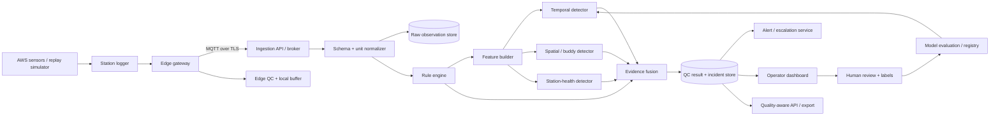
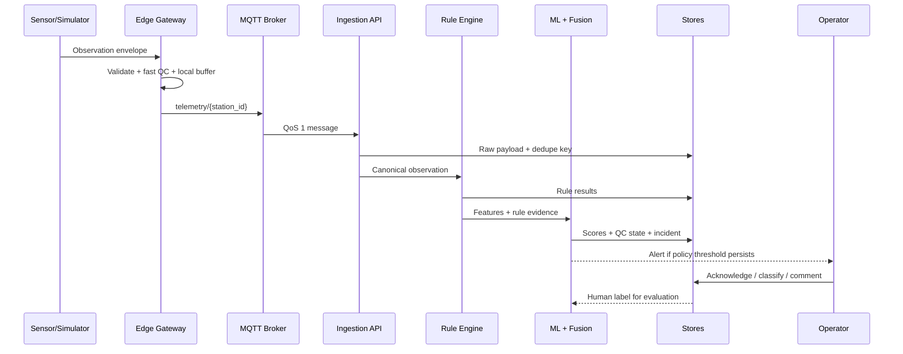

# Monsoon Sentinel — System Design

**Version:** 1.0  
**Status:** Hackathon-ready reference design  
**Audience:** Backend, ML, edge, frontend, DevOps, and documentation teammates

## 1. Design principles

The design follows six principles. **Raw data is immutable.** Every transformation produces a linked derived record. **Rules come before models.** Cheap, interpretable checks catch obvious failures and generate features for ML. **Anomalies are contextual.** A rare observation can be genuine weather, so the detector uses time, related variables, trusted neighbors, and external event context. **Human review is part of the system.** Operators can override or confirm an automated disposition, and those actions become labelled evidence. **Edge-first resilience is mandatory.** The gateway must keep collecting and checking data during cloud outages. **Every decision is reproducible.** Rules, thresholds, feature versions, model versions, and evidence are stored with the result.

The staged QC pattern is informed by NOAA MADIS, which separates validity, temporal, internal, and spatial checks and uses distinct quality descriptors.[3] It is also consistent with the NOAA NWS description of range, temporal continuity, spatial consistency, and error-log review.[6] The design does not claim certification against WMO standards; WMO-No. 8 remains the standards reference to validate with the relevant authority and current publication.[4]

## 2. Logical architecture



The system has an edge plane and a central plane. The edge plane receives the station stream, performs deterministic checks, stores a short local buffer, and can raise a connectivity or severe sensor-health incident without waiting for the cloud. The central plane receives replay-safe events, stores the immutable payload and normalized observation, computes fleet context, runs heavier detectors, fuses evidence, alerts operators, and supports review and retraining.

## 3. Component responsibilities

| Component | Responsibility | Suggested implementation | Failure behaviour |
| --- | --- | --- | --- |
| Station adapter | Convert vendor or simulator payloads into a common envelope | Python adapter, serial/HTTP/MQTT plugin | Quarantine malformed payload; do not fabricate values. |
| Edge gateway | Buffer, normalize basic fields, run fast QC, publish to broker | Python service on Raspberry Pi/industrial PC | Continue local storage and retry with exponential backoff. |
| MQTT broker | Decouple producers and consumers; route telemetry and incidents | Mosquitto for demo, managed broker for production | Persistent sessions and QoS 1; reject unauthorized topics. |
| Ingestion service | Authenticate, deduplicate, validate, and enqueue messages | FastAPI + Pydantic | Return structured error; preserve rejected payload metadata. |
| Raw store | Preserve source payload and hash | Object storage or append-only table | Write before downstream processing. |
| Observation store | Query canonical time-series observations | PostgreSQL/TimescaleDB or InfluxDB | Mark write failure; retain event in queue. |
| Rule engine | Run range, time, internal, and health checks | Pure Python functions with config | Emit reason code and continue independent checks. |
| Feature service | Build temporal, spatial, and health features | Python/Pandas/NumPy for demo | Mark feature unavailable instead of imputing silently. |
| ML detector | Produce anomaly scores and feature evidence | Isolation Forest baseline; optional LSTM/AE | Fall back to rules and mark model unavailable. |
| Evidence fusion | Combine heterogeneous signals into severity and state | Weighted score + policy engine | Preserve all component scores. |
| Incident service | Deduplicate, persist, assign, escalate | FastAPI worker + database | Retry notifications; never lose incident record. |
| Dashboard | Map, station list, timeline, evidence, review | React + chart library | Read-only degraded mode if action API is unavailable. |
| Model registry | Store approved model, feature, and threshold versions | Files + metadata table for MVP | Inference uses last approved model. |
| Evaluation runner | Fault injection, replay, and metrics | Python CLI/notebook | Produce versioned report artifact. |

## 4. Canonical data contract

The canonical event is intentionally richer than a simple `{temperature, humidity}` payload. IMD’s API reference demonstrates the importance of station identity, UTC observation time, pressure, wind, temperature, humidity, rainfall, and station mapping fields.[8]

```json
{
  "event_id": "aws-07-20260827T081000Z-000123",
  "station_id": "AWS-07",
  "source": "simulator|vendor_x|imd_adapter",
  "observed_at": "2026-08-27T08:10:00Z",
  "received_at": "2026-08-27T08:10:02Z",
  "sequence": 123,
  "location": {
    "latitude": 17.3850,
    "longitude": 78.4867,
    "elevation_m": 542.0,
    "timezone": "Asia/Kolkata"
  },
  "measurements": {
    "air_temperature": {"value": 29.4, "unit": "degC", "quality": "raw"},
    "relative_humidity": {"value": 71.2, "unit": "percent", "quality": "raw"},
    "pressure": {"value": 1004.8, "unit": "hPa", "quality": "raw"},
    "wind_speed": {"value": 14.0, "unit": "kmh", "quality": "raw"},
    "wind_direction": {"value": 230, "unit": "degree", "quality": "raw"},
    "rainfall": {"value": 0.0, "unit": "mm", "quality": "raw"},
    "solar_radiation": {"value": 422.0, "unit": "Wm2", "quality": "raw"}
  },
  "health": {
    "battery_v": 12.4,
    "signal_dbm": -79,
    "gateway_uptime_s": 220104,
    "firmware_version": "1.3.0"
  },
  "payload_sha256": "..."
}
```

The observation table should contain `event_id`, `station_id`, `variable`, `observed_at`, `received_at`, `raw_value`, `canonical_value`, `raw_unit`, `canonical_unit`, `source`, `sequence`, `ingestion_status`, `quality_state`, `reason_codes`, `anomaly_score`, `model_version`, `feature_version`, and `created_at`. The model-result table should keep one row per detector, including detector name, score, threshold, reference window, feature snapshot, and execution latency. The incident table should contain incident ID, station, variables, first/last occurrence, severity, confidence or score type, evidence IDs, lifecycle status, assignee, comments, escalation timestamps, and final disposition.

## 5. Processing sequence



The idempotency key is `event_id`; if a vendor has no stable event ID, the gateway creates one from station ID, observed timestamp, sequence, and payload hash. The ingestion service should accept duplicate delivery safely and return `200` or `202` with a duplicate status rather than create a second observation or incident.

## 6. Rule engine design

Rules are configuration-driven and versioned. A station profile defines expected cadence, units, variable availability, instrument limits, installation metadata, and trusted neighbours. A rule is a pure function that receives the current observation and a bounded context window and returns a structured result.

| Rule family | Example implementation | Output |
| --- | --- | --- |
| Envelope | Value is finite; unit is allowed; timestamp is parseable; station exists | `SCHEMA_FAIL`, `UNIT_FAIL`, `TIMESTAMP_FAIL`. |
| Range | Variable-specific hard and operational bounds; station profile overrides | `RANGE_FAIL` with bound and value. |
| Freshness | `received_at - observed_at` and inter-arrival time | `STALE_VALUE`, `COMMUNICATION_GAP`. |
| Duplicate | Event ID, timestamp/value hash, sequence monotonicity | `DUPLICATE`, `SEQUENCE_REGRESSION`. |
| Rate | Robust derivative over configured interval | `RATE_FAIL`. |
| Flatline | Rolling variance and run length, adjusted for sensor resolution | `FLATLINE`. |
| Internal consistency | Dew point ≤ temperature; rainfall accumulator non-decreasing unless reset; wind direction is bounded; daylight radiation is plausible | `INTERNAL_INCONSISTENCY`. |
| Cross-variable | Humidity, temperature, pressure, rainfall, solar, and wind relationships | `CROSS_VARIABLE_SUSPECT`. |
| Health | Battery, signal, uptime, reboot count, sensor heartbeat | `POWER_LOW`, `GATEWAY_REBOOT`, `SENSOR_OFFLINE`. |

The design should never use one universal threshold for all Indian stations. Operational limits should be derived from sensor specifications and station metadata, while learned thresholds should be station- and season-aware. The first baseline may use safe defaults, but the dashboard must show which configuration produced a result.

## 7. Feature engineering

Features are computed per variable and per station at several windows, such as the last 10 minutes, hour, day, and rolling seasonal baseline. The feature table includes robust residual from rolling median, MAD score, exponentially weighted residual, slope, volatility, first difference, second difference, flatline duration, missingness run length, time since last valid observation, time-of-day and day-of-year encodings, sensor-health values, and rule-failure counts.

Spatial features include distance-weighted median of trusted neighbours, median absolute peer deviation, peer count, elevation-adjusted residual where applicable, correlation to each peer over a recent history, and fraction of peers supporting the same change. A peer should be removed from the reference set if it is currently `SUSPECT` or `REJECTED`, if it has a communication gap, or if its historical correlation is too low.

Event-context features include multi-variable coherence, nearby-station agreement, rainfall or lightning context when legally and technically available, and whether a rapid change is consistent with a storm or front. IMD lists rainfall, warnings, cyclone, radar, lightning, and AWS/ARG categories in its API catalogue, making these possible context adapters subject to access and terms validation.[8]

## 8. ML model stack

### 8.1 MVP model: engineered-feature Isolation Forest

Train one global model per variable family or station cluster on windows believed to be normal. Use robust scaling, exclude known bad observations, and retain the training period and feature version. Isolation Forest is suitable as a baseline because it can handle unlabelled data and non-linear feature combinations. It is not a time-series model by itself, so the temporal information is represented by engineered windows.

### 8.2 Optional sequence model: LSTM or compact autoencoder

For stations with enough clean history, train a sequence autoencoder to reconstruct multivariate windows. The reconstruction residual becomes a second detector. An LSTM autoencoder is promising when temporal patterns matter, and a recent open-access study reported better performance from LSTM than plain and variational autoencoders on one air-temperature QC task.[5] That evidence supports an experiment, not a guaranteed architecture. The team must compare it with rules, robust statistics, and Isolation Forest under the same chronological evaluation.

### 8.3 Online baseline

At the edge, maintain rolling medians, MAD, exponentially weighted means, and a compact station-health state. This baseline requires no model download and remains available when the cloud is offline. A published edge IoT architecture similarly uses local processing and lightweight z-score anomaly detection for constrained devices.[11]

## 9. Evidence fusion and policy

The fusion service should preserve detector independence while combining results into a transparent score. A simple MVP policy can be:

```text
rule_score = weighted normalized severity of deterministic failures
model_score = calibrated percentile of model anomaly score
spatial_score = peer disagreement adjusted by peer trust
health_score = station-health risk
coherence_score = support for genuine-weather event

fault_risk = 0.35*rule_score + 0.25*model_score +
             0.25*spatial_score + 0.15*health_score

if coherence_score >= 0.75 and peer_support >= 2:
    disposition = GENUINE_EXTREME_CANDIDATE
elif fault_risk >= 0.80 and persists for 2 observations:
    disposition = REJECTED or SUSPECT according to rule policy
elif fault_risk >= 0.55:
    disposition = SUSPECT
else:
    disposition = ACCEPTED
```

The numeric weights are starting policy values, not validated truth. Store them in configuration and tune them on fault-injection and expert-review data. A more mature version can use calibrated logistic regression or Bayesian evidence fusion. The meteorological assessment repository provides an example of benchmarking individual tests and merging evidence through a Bayesian update, which supports the idea of explicit evidence fusion.[9]

The incident policy must add persistence windows, hysteresis, deduplication, cooldowns, and escalation. A single spike may create an observation flag but not a page. A communication gap may alert immediately if a station is critical. A genuine extreme candidate should notify an analyst without automatically rejecting data.

## 10. API surface

| Method | Endpoint | Purpose |
| --- | --- | --- |
| `POST` | `/v1/observations` | Ingest one canonical observation. |
| `POST` | `/v1/observations/batch` | Ingest replay or buffered batch with idempotency. |
| `GET` | `/v1/stations` | List stations, metadata, health, and current quality summary. |
| `GET` | `/v1/stations/{id}/timeline` | Query observations and QC states over a time range. |
| `GET` | `/v1/incidents` | Filter incidents by status, severity, station, and date. |
| `GET` | `/v1/incidents/{id}` | Return evidence graph, timeline, and recommended actions. |
| `PATCH` | `/v1/incidents/{id}` | Acknowledge, assign, comment, close, or reopen. |
| `GET` | `/v1/quality/export` | Export raw, canonical, and quality-aware records. |
| `POST` | `/v1/replay/runs` | Start a fault-injection or historical replay run. |
| `GET` | `/v1/models/active` | Show approved models, thresholds, and feature versions. |
| `GET` | `/healthz` | Liveness and readiness checks. |

Example incident response:

```json
{
  "incident_id": "INC-20260827-0014",
  "station_id": "AWS-07",
  "variables": ["relative_humidity", "air_temperature"],
  "severity": "high",
  "score_type": "fault_risk",
  "score": 0.87,
  "quality_state": "SUSPECT",
  "reason_codes": ["FLATLINE", "INTERNAL_INCONSISTENCY", "SPATIAL_OUTLIER"],
  "explanation": "Humidity remained almost unchanged for 55 minutes, violates the configured dew-point relationship, and disagrees with two trusted nearby stations.",
  "recommended_actions": ["Inspect humidity probe and cable", "Check enclosure condensation", "Compare with field reference instrument"],
  "evidence_ids": ["EV-1", "EV-2", "EV-3"],
  "model_version": "iforest-v3",
  "status": "open"
}
```

## 11. Storage and retention

For the hackathon, PostgreSQL can store station metadata, observations, rule results, incidents, and labels. Raw payloads can be stored in a local object directory or object storage with SHA-256 hashes. A production design should separate hot time-series data from immutable raw archives and long-term aggregates.

Recommended indexes are `(station_id, observed_at)`, `(variable, observed_at)`, `(quality_state, observed_at)`, and incident status/severity indexes. Retain enough context to reconstruct every alert. Do not store only aggregated anomaly scores; the original feature snapshot and detector configuration are needed for review.

## 12. Edge/offline behaviour

The gateway writes each incoming event to a local append-only queue before publishing. It maintains a `pending`, `sent`, and `acknowledged` state keyed by `event_id`. During an outage it continues to record observations, runs envelope, range, freshness, flatline, and health checks, and raises a local “cloud unavailable” health event. On reconnection it replays in observed-time order with bounded batches and idempotency keys.

A local model should be small and version-pinned. If the model is unavailable, rules still run. If the clock is invalid, the gateway must mark timestamps as untrusted and avoid temporal conclusions until synchronization is restored.

## 13. Security design

| Area | MVP control | Production direction |
| --- | --- | --- |
| Device identity | Per-device token in environment/config, never in source | Mutual TLS certificates and rotation. |
| Transport | Local broker or TLS-enabled MQTT | TLS 1.2+, topic ACLs, secure provisioning. |
| Integrity | Event ID, sequence, payload hash | Signed envelopes and anti-replay nonce/window. |
| API | JWT or basic service token for demo | OIDC, role-based access control, audit logs. |
| Data | Separate raw and derived records | Encryption at rest, key management, retention policy. |
| Model | Approved local model file and checksum | Signed model artifacts, registry approvals, rollback. |
| Alerts | Allow-listed webhook/email adapters | Secret vault, rate limits, notification audit. |

## 14. Testing strategy

Unit tests should cover every rule with boundary values, missing values, unit conversion, timestamp edge cases, wind-direction wraparound, accumulator resets, duplicate events, and peer exclusion. Property-based tests should verify that a duplicate event cannot create a duplicate incident and that a suspect peer cannot dominate a spatial baseline.

Integration tests should publish a sequence through MQTT or HTTP and verify that the raw payload, canonical observation, rule results, model result, incident, and dashboard API agree on event ID and timestamp. Offline tests should stop the broker, publish a batch, restart the broker, replay, and confirm exactly-once logical ingestion.

Model tests should use chronological splits and separate fault families. Metrics should include event precision and recall, false alerts per station-day, detection delay, per-class confusion matrix, calibration, and explanation completeness. The benchmark runner should save input manifest, random seed, injected faults, model version, rule configuration, and output metrics.

## 15. Observability

The service exposes ingestion rate, end-to-end latency, queue depth, duplicate rate, rejected payloads, missingness, rule-failure rate, anomaly score distribution, open incidents, notification failures, operator feedback, and model drift. The most important dashboard distinction is between **data quality**, **station health**, and **weather event candidates**; combining them into one red number obscures the operator’s next action.

Logs must include correlation ID, event ID, station ID, rule/model version, and latency. Metrics should be aggregated without logging sensitive credentials or full payloads unnecessarily. Traces are optional for the MVP but useful between ingestion, feature building, fusion, and notification.

## 16. Implementation sequence

| Sprint slice | Engineering output | Demo checkpoint |
| --- | --- | --- |
| Slice A | Repository skeleton, schema, simulator, seed station profiles | Normal MQTT/HTTP stream visible. |
| Slice B | Raw/canonical storage and deterministic rules | Range, gap, duplicate, flatline, and internal checks work. |
| Slice C | Timeline features, peer registry, spatial baseline | Station outlier is explainable. |
| Slice D | Isolation Forest, evidence fusion, incident lifecycle | Fault injection creates ranked incidents. |
| Slice E | Dashboard map/list/timeline/review | Teammate can review and classify an incident. |
| Slice F | Offline buffer, replay, evaluation report, model card | Resilience and quantified results are demonstrable. |

## 17. Architecture decisions and rejected shortcuts

The design chooses an ensemble over a deep-learning-only model because the problem includes deterministic data-contract errors and equipment-health failures that a learned model may not understand. It chooses a canonical schema because open-source weather QA/QC tooling shows that data normalization and unit conversion are foundational, not optional.[10] It chooses explainable reason codes over generated prose because an operator must be able to trace the alert to a value, threshold, peer, or model feature.

The design rejects random replacement of missing values, silent interpolation, public MQTT brokers, a single global threshold, one-class accuracy claims without labels, and automatic deletion of raw observations. A small demo that is honest about limitations is stronger than a large demo that cannot reproduce its own alerts.

## 18. References

[3]: https://madis.ncep.noaa.gov/madis_RSAS_qc_notes.shtml "NOAA/NCEP MADIS RSAS Quality Control Checks"
[4]: https://library.wmo.int/viewer/68695/ "WMO e-Library, WMO-No. 8 Guide to Instruments and Methods of Observation"
[5]: https://www.cambridge.org/core/journals/environmental-data-science/article/machine-learning-approach-using-autoencoders-to-perform-quality-control-on-meteorological-data/4576781508080877E36C0CA6612E5590 "Spohn et al. 2026, A machine learning approach using autoencoders to perform quality control on meteorological data"
[6]: https://training.weather.gov/nwstc/Hydrology/HYDRO/QCModule/QCConc.HTML "NOAA NWS Training Center, Quality Control Concepts"
[8]: https://api.imd.gov.in/public/api_reference.html "India Meteorological Department API Reference"
[9]: https://github.com/tomasfbouvier/Meteorological_Data_quality_assesment "Meteorological_Data_quality_assesment GitHub repository"
[10]: https://github.com/WSWUP/agweather-qaqc "WSWUP/agweather-qaqc GitHub repository"
[11]: https://arxiv.org/html/2606.14712v1 "EdgeStream: Secure and Low-Latency IoT Analytics Using an Edge-Based Streaming Architecture"
