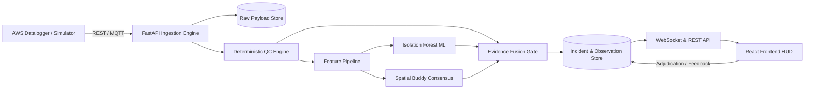

# SkyGuard-AI — Backend Architecture & Implementation Specification

> **Document Version:** 1.0.0  
> **Source Analysis:** Synthesized from [`DOCS/system.md`](file:///d:/SkyGuard-AI/DOCS/system.md), [`DOCS/system_design.md`](file:///d:/SkyGuard-AI/DOCS/system_design.md), and [`DOCS/skill.md`](file:///d:/SkyGuard-AI/DOCS/skill.md).

---

## 1. Executive Summary & Current State

### Current State
* **Frontend:** 100% React 18 SPA (Vite) with Cyberpunk Tactical Command UI (Central Admin & Station HUD).
* **Current Logic:** QC rules, 3-second simulation ticks, and anomaly score emulation currently run **in-memory inside the browser client** (`src/utils/qcEngine.js`, `src/context/WeatherContext.jsx`).

### Backend Objective
Build a production-grade, asynchronous **Python (FastAPI)** backend service with a persistent **SQLite / PostgreSQL** time-series data store, real **Scikit-Learn Isolation Forest** ML inference, and **WebSocket live streams** to bridge directly into the React frontend.



---

## 2. Target Directory Structure (`backend/`)

```text
backend/
├── app/
│   ├── main.py                  # FastAPI application entrypoint & middleware
│   ├── config.py                # Environment variables, threshold configs, JWT secrets
│   ├── contracts/               # Pydantic data contracts & schemas
│   │   ├── observation.py       # Canonical observation envelope & WMO units
│   │   ├── incident.py          # Incident lifecycle & adjudication schemas
│   │   └── station.py           # Station metadata & buddy network definitions
│   ├── adapters/                # Ingestion adapters
│   │   ├── mqtt_consumer.py     # Cellular MQTT broker listener (QoS 1)
│   │   └── csv_ingestor.py      # Historical batch CSV / Campbell Scientific parser
│   ├── storage/                 # Database models & repositories
│   │   ├── database.py          # SQLAlchemy async session manager (SQLite / Postgres)
│   │   ├── models.py            # ORM tables (raw_payloads, observations, incidents)
│   │   └── crud.py              # Query helpers & audit trail writers
│   ├── qc/                      # Deterministic Quality Control
│   │   ├── range_checks.py      # Physical plausibility limits
│   │   ├── rate_checks.py       # 10-minute derivative / delta rate of change
│   │   ├── flatline_checks.py   # Stuck invariant ADC detection
│   │   ├── cross_variable.py    # Dew point plausibility (Td <= T)
│   │   └── health_checks.py     # Battery float voltage (Vbat < 11.8V) & RSSI
│   ├── features/                # Temporal & Spatial Feature Engineering
│   │   ├── temporal.py          # Rolling median, MAD score, 1st/2nd difference
│   │   └── spatial.py           # Distance-weighted buddy peer consensus & lapse rates
│   ├── models/                  # Station-Adaptive ML Engine
│   │   ├── isolation_forest.py  # Model loader, scorer, and feature transformer
│   │   ├── model_card.py        # Cryptographic metadata & SHA-256 validation
│   │   └── artifacts/           # Station-isolated models: {station_id}/model_v1.json / .pkl
│   ├── fusion/                  # Multi-Signal Evidence Fusion
│   │   ├── fusion_engine.py     # Weighted score calculator & severe storm coherence gate
│   │   └── policy.py            # Quality state mapper (ACCEPTED, SUSPECT, EXTREME)
│   └── api/                     # REST & WebSocket Endpoints
│       ├── v1/
│       │   ├── telemetry.py     # Ingest & live telemetry queries
│       │   ├── stations.py      # Station registry & hardware diagnostics
│       │   ├── incidents.py     # Incident queue & operator adjudication
│       │   ├── governance.py    # Model cards, drift metrics, hot rollback
│       │   ├── credentials.py   # Station RBAC provisioning
│       │   └── export.py        # Cryptographically signed telemetry export
│       └── websockets.py        # Real-time WebSocket broadcasting (`/ws/telemetry`)
├── ml/                          # Station-Adaptive & Spatial Pipeline
│   ├── station_adaptive_pipeline.py # Station-specific Isolation Forest pipeline
│   ├── test_station_isolation.py    # Automated test suite proving Model A != Model B
│   ├── spatial_engine.py        # Haversine distance, neighborhood filtering, robust MAD
│   ├── test_spatial_intelligence.py # Automated test suite (8 spatial intelligence scenarios)
│   ├── fault_generator.py       # Synthetic stress tests (spikes, drift, flatlines)
│   └── evaluate_metrics.py      # Event Precision, Recall, Delay, Brier score runner
├── tests/                       # Pytest test suite
│   ├── test_qc_rules.py         # Boundary & physical limits tests
│   ├── test_idempotency.py      # Deduplication & replay validation
│   └── test_api.py              # FastAPI endpoint integration tests
├── requirements.txt             # Python dependencies
└── Dockerfile                   # Container specification
```

---

## 3. Database Schema (SQLite / PostgreSQL)

### 1. `raw_payloads` (Immutable Audit Store)
* `id`: `INTEGER PRIMARY KEY AUTOINCREMENT`
* `event_id`: `VARCHAR(64) UNIQUE NOT NULL` (Idempotency Key)
* `station_id`: `VARCHAR(32) NOT NULL`
* `payload_json`: `TEXT NOT NULL` (Raw incoming JSON/string from datalogger)
* `payload_sha256`: `VARCHAR(64) NOT NULL`
* `received_at`: `TIMESTAMP NOT NULL`

### 2. `canonical_observations` (Time-Series Measurements)
* `id`: `INTEGER PRIMARY KEY AUTOINCREMENT`
* `event_id`: `VARCHAR(64) REFERENCES raw_payloads(event_id)`
* `station_id`: `VARCHAR(32) NOT NULL`
* `observed_at`: `TIMESTAMP NOT NULL`
* `temperature_c`: `FLOAT`
* `humidity_pct`: `FLOAT`
* `pressure_hpa`: `FLOAT`
* `wind_speed_kmh`: `FLOAT`
* `wind_direction_deg`: `FLOAT`
* `rainfall_mm`: `FLOAT`
* `solar_wm2`: `FLOAT`
* `battery_v`: `FLOAT`
* `signal_dbm`: `FLOAT`
* `quality_state`: `VARCHAR(32)` (`ACCEPTED`, `SUSPECT`, `GENUINE_EXTREME_CANDIDATE`, `REJECTED`)
* `fault_risk`: `FLOAT` (0.0 to 1.0)
* `reason_codes`: `JSON` (e.g. `["SPATIAL_OUTLIER", "RATE_FAIL"]`)

### 3. `incidents` (Adjudication & Triage Queue)
* `incident_id`: `VARCHAR(64) PRIMARY KEY` (e.g. `INC-20260828-001`)
* `station_id`: `VARCHAR(32) NOT NULL`
* `variable`: `VARCHAR(32) NOT NULL`
* `severity`: `VARCHAR(16)` (`low`, `medium`, `high`, `critical`)
* `fault_risk`: `FLOAT` NOT NULL
* `quality_state`: `VARCHAR(32)` NOT NULL
* `reason_codes`: `JSON` NOT NULL
* `explanation`: `TEXT NOT NULL`
* `evidence_graph`: `JSON NOT NULL`
* `status`: `VARCHAR(16)` (`open`, `acknowledged`, `assigned`, `resolved`)
* `created_at`: `TIMESTAMP NOT NULL`
* `resolved_at`: `TIMESTAMP NULL`

### 4. `adjudication_audit_log` (Human-in-the-Loop Labels)
* `id`: `INTEGER PRIMARY KEY AUTOINCREMENT`
* `incident_id`: `VARCHAR(64) REFERENCES incidents(incident_id)`
* `operator_name`: `VARCHAR(64) NOT NULL`
* `operator_role`: `VARCHAR(32) NOT NULL`
* `action`: `VARCHAR(32)` (`ACKNOWLEDGE`, `CONFIRM_GENUINE`, `FLAG_DEFECT`)
* `operator_comment`: `TEXT`
* `timestamp`: `TIMESTAMP NOT NULL`

---

## 4. API Endpoints Specification

### Ingestion & Stream
* `POST /api/v1/telemetry/ingest`: Ingests a single observation or batch envelope with deduplication.
* `WS /ws/telemetry`: Real-time WebSocket connection streaming 3-second live updates, QC scores, and alerts to connected frontend clients.

### Stations & Cockpit
* `GET /api/v1/stations`: Returns all registered stations, coordinates, status, and latest telemetry.
* `GET /api/v1/stations/{id}/hud`: Returns high-resolution time-series history, sensor gauges, and buddy peer comparisons.
* `GET /api/v1/stations/{id}/diagnostics`: Returns power subsystem, solar charge, RSSI, and gateway storage metrics.

### Incident Triage & Human Review
* `GET /api/v1/incidents`: Queries open and historical incidents with filtering by severity, station, and date range.
* `POST /api/v1/incidents/{id}/adjudicate`: Submits operator verdict (`ACKNOWLEDGE`, `GENUINE_EXTREME_CONFIRMED`, `REJECTED`) and writes to immutable audit store.

### QC Calibration & Model Governance
* `GET /api/v1/qc/config`: Returns active deterministic physical bounds and fusion weight matrix.
* `PUT /api/v1/qc/config`: Updates thresholds in real-time.
* `GET /api/v1/models/registry`: Returns active model cards, SHA-256 signatures, chronological validation metrics, and feature definitions.
* `POST /api/v1/models/{id}/rollback`: Executes an immediate hot rollback to a previous checkpoint artifact.

### Quality Export
* `GET /api/v1/export/verified`: Generates signed JSON/CSV dataset with SHA-256 audit hashes for numerical weather prediction (NWP).

---

## 5. Phased Implementation Roadmap

```text
Phase 1: Core Framework & Contracts (1-2 Days)
├── Set up FastAPI app with async SQLAlchemy (SQLite for dev, Postgres for prod).
├── Implement Pydantic data contract & idempotency check on event_id.
└── Seed initial stations, credentials, and model registry metadata.

Phase 2: Layered QC Engine & Feature Pipeline (2 Days)
├── Implement deterministic checks (range, 10-min rate of change, flatline, dew point).
├── Implement hardware health penalty (battery voltage & RSSI).
└── Implement distance-weighted spatial buddy peer consensus.

Phase 3: Python ML Training & Scoring Engine (2 Days)
├── Build offline training script using scikit-learn IsolationForest.
├── Train model weights on historical weather dataset with synthetic fault injection.
├── Implement score normalization and feature importance extraction.
└── Export versioned model checkpoint (.pkl) and cryptographic Model Card (.json).

Phase 4: Evidence Fusion & Incident Lifecycle (1-2 Days)
├── Implement multi-signal evidence fusion formula.
├── Implement Severe Storm Coherence Gate (Rain > 30mm + Wind > 30km/h + Radar echo).
└── Implement incident creation, deduplication, and human adjudication logging.

Phase 5: WebSocket Streaming & Frontend Bridge (1 Day)
├── Implement /ws/telemetry WebSocket broadcaster.
└── Connect React frontend (WeatherContext & AuthContext) to live FastAPI backend.
```

---

## 6. Python Dependencies (`backend/requirements.txt`)

```text
fastapi>=0.115.0
uvicorn[standard]>=0.30.0
pydantic>=2.8.0
sqlalchemy[asyncio]>=2.0.30
aiosqlite>=0.20.0
asyncpg>=0.29.0
scikit-learn>=1.5.0
numpy>=1.26.0
pandas>=2.2.0
websockets>=12.0
paho-mqtt>=2.1.0
pytest>=8.2.0
httpx>=0.27.0
```
