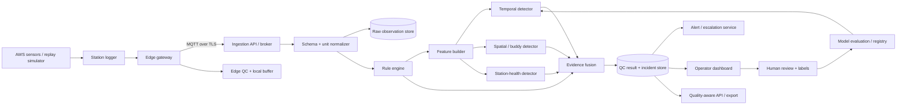
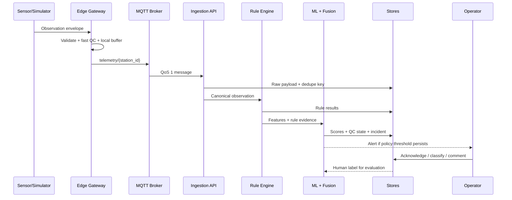

# System Design — Monsoon Sentinel

Version 1.0 · Hackathon-ready reference design for backend, ML, edge, frontend, and DevOps work.
Read `system.md` first for the requirements this design satisfies, and `skill.md` for the
standing operating rules while implementing it.

## 1. Design principles

**Raw data is immutable** — every transformation produces a linked derived record.
**Rules come before models** — cheap, interpretable checks catch obvious failures and generate
features for ML. **Anomalies are contextual** — a rare observation can be genuine weather, so the
detector uses time, related variables, trusted neighbors, and external event context. **Human
review is part of the system** — operators override or confirm a disposition, and those actions
become labelled evidence. **Edge-first resilience is mandatory** — the gateway keeps collecting
and checking data through cloud outages. **Every decision is reproducible** — rules, thresholds,
feature versions, model versions, and evidence are stored with the result.

This does not claim WMO certification; treat published standards as a reference to validate
against later, not a badge to display now.

## 2. Logical architecture



Two planes: **edge** (receives the station stream, runs deterministic checks, keeps a short
local buffer, can raise a connectivity or severe-health incident without waiting for the cloud)
and **central** (stores the immutable payload and normalized observation, computes fleet
context, runs heavier detectors, fuses evidence, alerts operators, supports review/retraining).

## 3. Component responsibilities

| Component | Responsibility | Suggested implementation | Failure behaviour |
| --- | --- | --- | --- |
| Station adapter | Convert vendor/simulator payloads into a common envelope | Python adapter, serial/HTTP/MQTT plugin | Quarantine malformed payload; never fabricate values |
| Edge gateway | Buffer, normalize basic fields, run fast QC, publish to broker | Python service on Raspberry Pi/industrial PC | Continue local storage, retry with exponential backoff |
| MQTT broker | Decouple producers/consumers; route telemetry and incidents | Mosquitto for demo, managed broker for production | Persistent sessions, QoS 1; reject unauthorized topics |
| Ingestion service | Authenticate, dedupe, validate, enqueue messages | FastAPI + Pydantic | Return structured error; preserve rejected payload metadata |
| Raw store | Preserve source payload and hash | Object storage or append-only table | Write before downstream processing |
| Observation store | Query canonical time-series observations | PostgreSQL/TimescaleDB or InfluxDB | Mark write failure; retain event in queue |
| Rule engine | Run range, time, internal, and health checks | Pure Python functions with config | Emit reason code and continue independent checks |
| Feature service | Build temporal, spatial, and health features | Python/Pandas/NumPy for demo | Mark feature unavailable instead of imputing silently |
| ML detector | Produce anomaly scores and feature evidence | Isolation Forest baseline; optional LSTM/AE | Fall back to rules; mark model unavailable |
| Evidence fusion | Combine heterogeneous signals into severity/state | Weighted score + policy engine | Preserve all component scores |
| Incident service | Dedupe, persist, assign, escalate | FastAPI worker + database | Retry notifications; never lose the incident record |
| Dashboard | Map, station list, timeline, evidence, review | React + chart library — see `ui/index.html` for visual direction | Read-only degraded mode if the action API is unavailable |
| Model registry | Store approved model/feature/threshold versions | Files + metadata table for MVP | Inference uses the last approved model |
| Evaluation runner | Fault injection, replay, metrics | Python CLI/notebook | Produce a versioned report artifact |

## 4. Canonical data contract

```json
{
  "event_id": "aws-07-20260827T081000Z-000123",
  "station_id": "AWS-07",
  "source": "simulator|vendor_x|imd_adapter",
  "observed_at": "2026-08-27T08:10:00Z",
  "received_at": "2026-08-27T08:10:02Z",
  "sequence": 123,
  "location": {
    "latitude": 17.3850,
    "longitude": 78.4867,
    "elevation_m": 542.0,
    "timezone": "Asia/Kolkata"
  },
  "measurements": {
    "air_temperature": {"value": 29.4, "unit": "degC", "quality": "raw"},
    "relative_humidity": {"value": 71.2, "unit": "percent", "quality": "raw"},
    "pressure": {"value": 1004.8, "unit": "hPa", "quality": "raw"},
    "wind_speed": {"value": 14.0, "unit": "kmh", "quality": "raw"},
    "wind_direction": {"value": 230, "unit": "degree", "quality": "raw"},
    "rainfall": {"value": 0.0, "unit": "mm", "quality": "raw"},
    "solar_radiation": {"value": 422.0, "unit": "Wm2", "quality": "raw"}
  },
  "health": {
    "battery_v": 12.4,
    "signal_dbm": -79,
    "gateway_uptime_s": 220104,
    "firmware_version": "1.3.0"
  },
  "payload_sha256": "..."
}
```

The **observation table** holds `event_id`, `station_id`, `variable`, `observed_at`,
`received_at`, `raw_value`, `canonical_value`, `raw_unit`, `canonical_unit`, `source`,
`sequence`, `ingestion_status`, `quality_state`, `reason_codes`, `anomaly_score`,
`model_version`, `feature_version`, `created_at`.

The **model-result table** holds one row per detector: detector name, score, threshold,
reference window, feature snapshot, execution latency.

The **incident table** holds incident ID, station, variables, first/last occurrence, severity,
confidence/score type, evidence IDs, lifecycle status, assignee, comments, escalation
timestamps, final disposition.

## 5. Processing sequence



Idempotency key is `event_id`; if a vendor has no stable ID, the gateway derives one from station
ID + observed timestamp + sequence + payload hash. Duplicate delivery must return `200`/`202`
with a duplicate status, never create a second observation or incident.

## 6. Rule engine design

Rules are configuration-driven and versioned. A station profile defines expected cadence, units,
variable availability, instrument limits, installation metadata, and trusted neighbours. A rule
is a pure function taking the current observation plus a bounded context window and returning a
structured result.

| Rule family | Example implementation | Output |
| --- | --- | --- |
| Envelope | Value finite; unit allowed; timestamp parseable; station exists | `SCHEMA_FAIL`, `UNIT_FAIL`, `TIMESTAMP_FAIL` |
| Range | Variable-specific hard/operational bounds; station-profile overrides | `RANGE_FAIL` with bound and value |
| Freshness | `received_at − observed_at` and inter-arrival time | `STALE_VALUE`, `COMMUNICATION_GAP` |
| Duplicate | Event ID, timestamp/value hash, sequence monotonicity | `DUPLICATE`, `SEQUENCE_REGRESSION` |
| Rate | Robust derivative over a configured interval | `RATE_FAIL` |
| Flatline | Rolling variance and run length, adjusted for sensor resolution | `FLATLINE` |
| Internal consistency | Dew point ≤ temperature; rainfall accumulator non-decreasing unless reset; wind direction bounded; daylight radiation plausible | `INTERNAL_INCONSISTENCY` |
| Cross-variable | Humidity/temperature/pressure/rainfall/solar/wind relationships | `CROSS_VARIABLE_SUSPECT` |
| Health | Battery, signal, uptime, reboot count, sensor heartbeat | `POWER_LOW`, `GATEWAY_REBOOT`, `SENSOR_OFFLINE` |

Never use one universal threshold for all stations. Operational limits come from sensor specs
and station metadata; learned thresholds are station- and season-aware. The dashboard must show
which configuration version produced a given result.

## 7. Feature engineering

Per variable and station, at several windows (10 min, hour, day, rolling seasonal baseline):
robust residual from rolling median, MAD score, exponentially-weighted residual, slope,
volatility, first/second difference, flatline duration, missingness run length, time since last
valid observation, time-of-day/day-of-year encodings, sensor-health values, rule-failure counts.

Spatial features: distance-weighted median of trusted neighbours, median absolute peer
deviation, peer count, elevation-adjusted residual where justified, correlation to each peer over
recent history, fraction of peers supporting the same change. Remove a peer from the reference
set if it is currently `SUSPECT`/`REJECTED`, has a communication gap, or its historical
correlation is too low.

Event-context features: multi-variable coherence, nearby-station agreement, rainfall/lightning
context where legally and technically available, whether a rapid change is consistent with a
storm or front.

## 8. ML model stack

**MVP — engineered-feature Isolation Forest.** Train one global model per variable family or
station cluster on windows believed to be normal. Use robust scaling, exclude known-bad
observations, retain the training manifest and feature version.

**Optional — sequence autoencoder/LSTM.** Only for stations with enough clean history; compare
fairly against rules + Isolation Forest under the same chronological evaluation before adopting.

**Edge/online baseline.** Rolling medians, MAD, exponentially-weighted means, a compact
station-health state. No model download required; stays available offline.

## 9. Evidence fusion and policy

```text
rule_score = weighted normalized severity of deterministic failures
model_score = calibrated percentile of model anomaly score
spatial_score = peer disagreement adjusted by peer trust
health_score = station-health risk
coherence_score = support for genuine-weather event

fault_risk = 0.35*rule_score + 0.25*model_score +
             0.25*spatial_score + 0.15*health_score

if coherence_score >= 0.75 and peer_support >= 2:
    disposition = GENUINE_EXTREME_CANDIDATE
elif fault_risk >= 0.80 and persists for 2 observations:
    disposition = REJECTED or SUSPECT according to rule policy
elif fault_risk >= 0.55:
    disposition = SUSPECT
else:
    disposition = ACCEPTED
```

These weights are starting policy values, not validated truth — store them in configuration and
tune on fault-injection/expert-review data.

The incident policy adds persistence windows, hysteresis, deduplication, cooldowns, and
escalation. A single spike creates an observation flag, not a page. A communication gap on a
critical station alerts immediately. A genuine-extreme candidate notifies an analyst without
auto-rejecting the data.

## 10. API surface

| Method | Endpoint | Purpose |
| --- | --- | --- |
| `POST` | `/v1/observations` | Ingest one canonical observation |
| `POST` | `/v1/observations/batch` | Ingest replay/buffered batch with idempotency |
| `GET` | `/v1/stations` | List stations, metadata, health, current quality summary |
| `GET` | `/v1/stations/{id}/timeline` | Observations + QC states over a time range |
| `GET` | `/v1/incidents` | Filter incidents by status, severity, station, date |
| `GET` | `/v1/incidents/{id}` | Evidence graph, timeline, recommended actions |
| `PATCH` | `/v1/incidents/{id}` | Acknowledge, assign, comment, close, reopen |
| `GET` | `/v1/quality/export` | Export raw, canonical, and quality-aware records |
| `POST` | `/v1/replay/runs` | Start a fault-injection or historical replay run |
| `GET` | `/v1/models/active` | Approved models, thresholds, feature versions |
| `GET` | `/healthz` | Liveness/readiness |

```json
{
  "incident_id": "INC-20260827-0014",
  "station_id": "AWS-07",
  "variables": ["relative_humidity", "air_temperature"],
  "severity": "high",
  "score_type": "fault_risk",
  "score": 0.87,
  "quality_state": "SUSPECT",
  "reason_codes": ["FLATLINE", "INTERNAL_INCONSISTENCY", "SPATIAL_OUTLIER"],
  "explanation": "Humidity remained almost unchanged for 55 minutes, violates the configured dew-point relationship, and disagrees with two trusted nearby stations.",
  "recommended_actions": ["Inspect humidity probe and cable", "Check enclosure condensation", "Compare with field reference instrument"],
  "evidence_ids": ["EV-1", "EV-2", "EV-3"],
  "model_version": "iforest-v3",
  "status": "open"
}
```

## 11. Storage, retention, and stack choice

Hackathon default: PostgreSQL for station metadata, observations, rule results, incidents, and
labels; raw payloads in a local object directory or object storage with SHA-256 hashes.
Simplify to SQLite + a local MQTT broker if setup time is short — architecture quality matters
more than infrastructure brand names.

Recommended indexes: `(station_id, observed_at)`, `(variable, observed_at)`, `(quality_state,
observed_at)`, and incident status/severity indexes. Keep the original feature snapshot and
detector configuration, not just the aggregated score — review needs it.

## 12. Edge/offline behaviour

The gateway writes each event to a local append-only queue before publishing, tracking
`pending`/`sent`/`acknowledged` by `event_id`. During an outage it keeps recording, runs
envelope/range/freshness/flatline/health checks, and raises a local "cloud unavailable" health
event. On reconnection it replays in observed-time order with bounded batches and idempotency
keys.

A local model must be small and version-pinned; if unavailable, rules still run. If the clock is
invalid, the gateway marks timestamps untrusted and avoids temporal conclusions until
synchronization is restored.

## 13. Security design

| Area | MVP control | Production direction |
| --- | --- | --- |
| Device identity | Per-device token in env/config, never in source | Mutual TLS certificates and rotation |
| Transport | Local broker or TLS-enabled MQTT | TLS 1.2+, topic ACLs, secure provisioning |
| Integrity | Event ID, sequence, payload hash | Signed envelopes, anti-replay window |
| API | JWT or basic service token for demo | OIDC, RBAC, audit logs |
| Data | Separate raw and derived records | Encryption at rest, key management, retention policy |
| Model | Approved local model file + checksum | Signed model artifacts, registry approvals, rollback |
| Alerts | Allow-listed webhook/email adapters | Secret vault, rate limits, notification audit |

## 14. Testing strategy

Unit tests cover every rule at boundary values, missing values, unit conversion, timestamp edge
cases, wind-direction wraparound, accumulator resets, duplicate events, peer exclusion.
Property-based tests confirm a duplicate event cannot create a duplicate incident and a suspect
peer cannot dominate a spatial baseline.

Integration tests publish a sequence through MQTT/HTTP and verify the raw payload, canonical
observation, rule results, model result, incident, and dashboard API agree on event ID and
timestamp. Offline tests stop the broker, publish a batch, restart, replay, and confirm
exactly-once logical ingestion.

Model tests use chronological splits and separate fault families, reporting event precision/
recall, false alerts per station-day, detection delay, per-class confusion matrix, calibration,
and explanation completeness. The benchmark runner saves input manifest, random seed, injected
faults, model version, rule configuration, and output metrics.

## 15. Observability

Expose ingestion rate, end-to-end latency, queue depth, duplicate rate, rejected payloads,
missingness, rule-failure rate, anomaly-score distribution, open incidents, notification
failures, operator feedback, model drift. Keep **data quality**, **station health**, and
**weather-event candidates** as distinct dashboard signals — combining them into one red number
obscures the operator's next action.

Logs include correlation ID, event ID, station ID, rule/model version, latency. Traces are
optional for the MVP.

## 16. Implementation sequence

| Slice | Engineering output | Demo checkpoint |
| --- | --- | --- |
| A | Repository skeleton, schema, simulator, seed station profiles | Normal MQTT/HTTP stream visible |
| B | Raw/canonical storage and deterministic rules | Range, gap, duplicate, flatline, internal checks work |
| C | Timeline features, peer registry, spatial baseline | Station outlier is explainable |
| D | Isolation Forest, evidence fusion, incident lifecycle | Fault injection creates ranked incidents |
| E | Dashboard map/list/timeline/review | Teammate can review and classify an incident |
| F | Offline buffer, replay, evaluation report, model card | Resilience and quantified results are demonstrable |

## 17. Architecture decisions and rejected shortcuts

Chosen: an ensemble over a deep-learning-only model, because the problem includes deterministic
data-contract and equipment-health failures a learned model may not understand. A canonical
schema, because normalization and unit conversion are foundational, not optional. Explainable
reason codes over generated prose, because an operator must trace an alert to a value, threshold,
peer, or feature.

Rejected: random replacement of missing values, silent interpolation, public MQTT brokers, a
single global threshold, one-class accuracy claims without labels, automatic deletion of raw
observations. A small, honest demo beats a large one that can't reproduce its own alerts.

## 18. Repository structure

```text
src/
  contracts/       # schemas, units, validation
  adapters/        # MQTT, REST, CSV, vendor and IMD-compatible adapters
  qc/              # deterministic checks and reason codes
  features/        # temporal, spatial and station-health features
  models/          # baseline, Isolation Forest, sequence models
  fusion/          # score calibration, state policy, incident rules
  storage/         # raw, canonical, results, incidents and labels
  api/             # ingestion, query, review, export
  edge/            # local buffer and offline replay
  ui/              # operator dashboard (see /ui/index.html for the visual direction)
  evaluation/      # fault injection, replay, metrics, reports
tests/
  unit/
  integration/
  property/
configs/
  stations/
  rules/
  models/
docs/
  system.md
  system_design.md
  skill.md
  reference/       # research notes, collaborator plan, original diagrams
```

A feature is complete when it has a documented contract, unit tests, an observable reason code
or metric, a replayable example, and a limitation statement.
